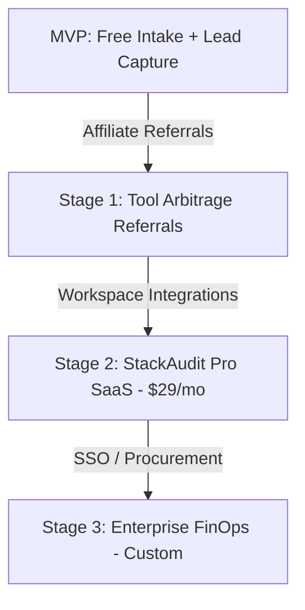

# StackAudit Go-To-Market (GTM) Strategy

This document outlines the tactical GTM playbook for launching StackAudit, driving user acquisition, and transitioning the MVP from a free utility to a self-sustaining B2B SaaS platform.

---

## 1. Positioning & Value Proposition

### Core Positioning
**StackAudit** is the *"Frictionless AI Waste Finder for Engineering Teams."* 

Unlike bloated enterprise FinOps platforms (e.g. Vertice, Zylo) that require weeks of SOC2 reviews, billing logins, and contract signatures, StackAudit delivers a detailed, CFO-ready cost-reduction report in under **3 minutes** without asking for a credit card or database write access.

### Value Proposition
> *"You are overpaying by ~$500/developer/year on overlapping, redundant, and over-provisioned AI tools. Stop guessing. Run a deterministic stack audit in 3 minutes and cut the waste today."*

---

## 2. Ideal Customer Profile (ICP)

### Seed to Series A Startups (5 to 50 team members)
- **Characteristics:** Engineering-heavy, highly decentralized tool selection (developers choose their own IDEs, models, and seats), rapidly growing AI spend.
- **The Pain Point:** Startups are bleeding money because individual developers are buying their own subscriptions (e.g. one dev uses Cursor Pro, another uses GitHub Copilot, another has Claude Pro, while the company has a shared ChatGPT Team account). 
- **The Buyer:** CTOs, Engineering Managers, or Founders who feel the pinch of monthly credit card bills but lack the time to manually audit individual seats.

---

## 3. Growth & Acquisition Loops

### A. The Viral Sharing Loop (Built-in)
Every audit produces a permanent public report URL (`/results/[id]`) that is clean, professional, and visually engaging.
- **The Loop:** A CTO runs the audit → generates the report → clicks "Share Report" → posts it to Slack to align with the CFO, or tweets it to show how they optimized their burn.
- **The Hook:** The public report contains a prominent banner: *"This team saved $1,240/yr. Run your own AI stack audit in 3 minutes."* This turns every shared report into a free acquisition landing page.

### B. Portfolio VC Partnerships
VC platform leads and operating partners are constantly looking for ways to extend runway for their portfolio companies.
- **The Loop:** We reach out to early-stage VCs (e.g. Y Combinator, Techstars, Sequoia Scout) and offer a co-branded version of the audit tool (e.g. `stackaudit.app/vc/sequoia`).
- **The Hook:** VCs distribute this to their portfolios as a free value-add tool during onboarding or quarterly burn-rate audits.

### C. Developer Community Distribution
- **Hacker News (Show HN):** Frame it around transparency: *"Show HN: An open-source, deterministic AI spend calculator. No invoice parsing, no credentials requested."* Developers appreciate privacy-centric calculators.
- **Reddit & X/Twitter:** Target subreddits like `r/startup`, `r/indiehackers`, and SaaS communities. Share anonymized stats about average AI waste (e.g., *"We audited 50 startup AI stacks; 78% were paying for overlapping Cursor + Copilot seats. Here is the math."*).

---

## 4. Launch Execution Plan

### Phase 1: Community Hunt (Days 1–7)
1. **Product Hunt Launch:** Position it as a free utility. Submit with high-fidelity screenshots of the results dashboard.
2. **X/Twitter Thread:** Break down the 6 deterministic rules we use to audit (plan overspends, redundancies, seat floor leaks, API switches, etc.).
3. **LinkedIn Outreach:** Direct outreach to Seed-stage founders offering a free 5-minute review of their AI billing.

### Phase 2: Content Marketing (Days 8–30)
1. **Pricing Transparency Reports:** Publish deep dives on SaaS vendor pricing traps (e.g., *"How ChatGPT Team's 2-seat minimum quietly inflates your bill by 100%"*).
2. **API vs. Chat Arbitrage Calculator:** Publish calculators showing the exact crossover point where switching developer teams to raw LLM API tokens is cheaper than buying seats.

---

## 5. Monetization Roadmap

### Stage 1: Affiliate Referrals & Tool Switch Commission (Months 1–3)
- Keep the core audit free.
- **Action:** Partner with alternative tool providers (e.g. Windsurf, Double.bot) or API gateway platforms.
- **Revenue:** Earn commissions when users click recommendation CTAs to purchase alternative tools or API credits.

### Stage 2: StackAudit Pro - Automated Continuous Monitoring (Months 3–6)
- **Price:** $29/month per organization.
- **Value:** Instead of a one-time manual audit, the pro version connects via read-only integrations to **Google Workspace (SSO)**, **Slack**, and **QuickBooks/Xero**.
- **Revenue:** Automatically scans invoice entries and workspace member counts monthly, instantly alerting the Slack channel when:
  1. A new employee signs up for an unapproved AI tool.
  2. An employee leaves the company, but their Claude/ChatGPT seat remains active.
  3. Spend exceeds historical thresholds.

### Stage 3: Enterprise Procurement Negotiation (Months 6+)
- **Value:** Provide aggregate pricing negotiation. We bundle buying power for 500 startups to negotiate bulk seat discounts with Anthropic, OpenAI, and Cursor.
- **Revenue:** Split the savings (e.g. we take 15% of the annual volume discount negotiated).
