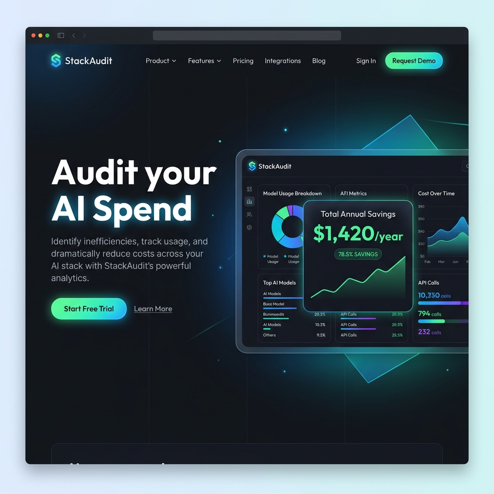
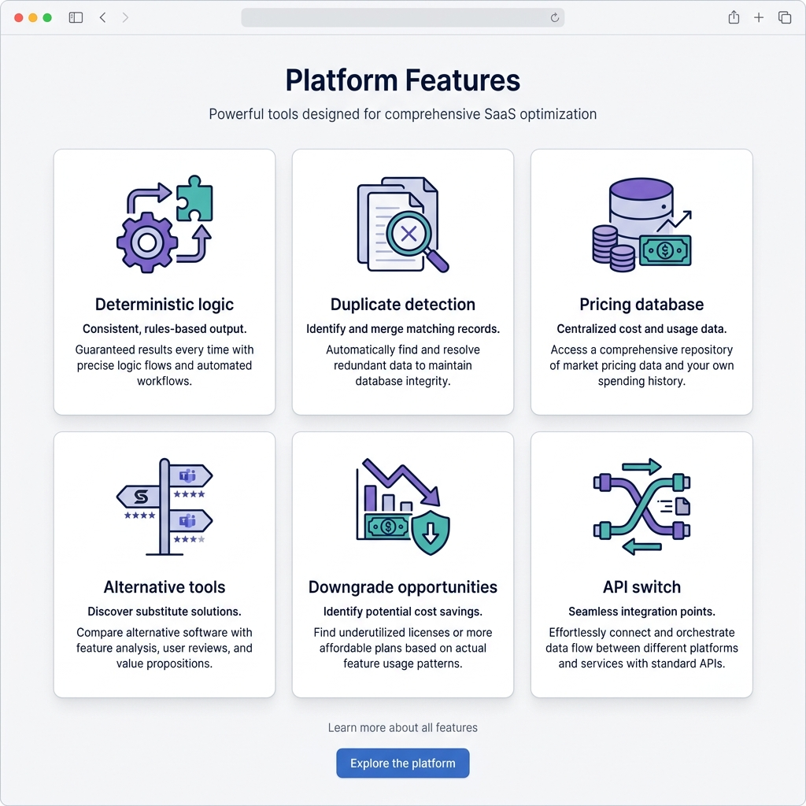
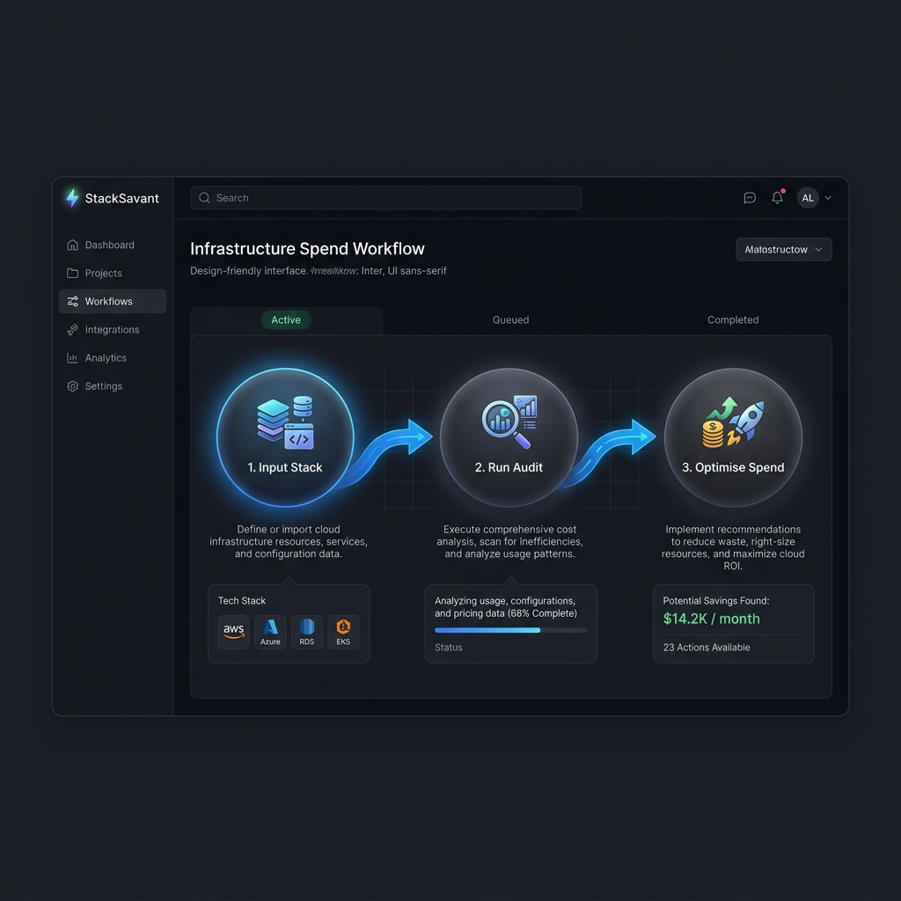
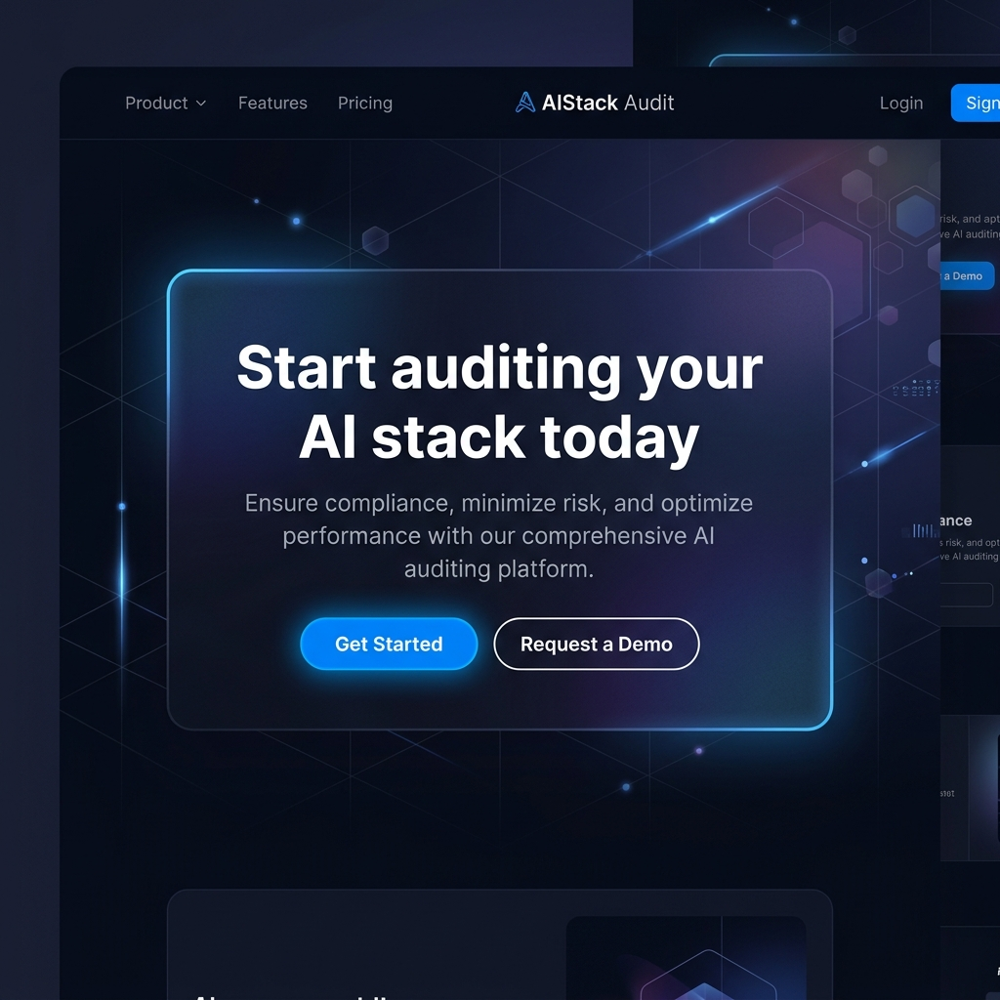

# StackAudit

**AI Spend Audit** — a production SaaS web app that helps startups analyze and optimize AI tool spending.

Built for the Credex hiring assignment. Deterministic audit logic, AI only for personalized summaries, shareable public reports.

## Tech stack

- **Framework:** Next.js 15 (App Router), TypeScript
- **UI:** Tailwind CSS, shadcn/ui, React Hook Form, Zod
- **Data:** Supabase
- **AI:** Google Gemini API (personalized summary only)
- **Email:** Resend
- **Testing:** Vitest, React Testing Library
- **Deploy:** Vercel

## Getting started

```bash
# Install dependencies
npm install

# Copy environment template
cp .env.example .env.local

# Run development server
npm run dev
```

Open [http://localhost:3000](http://localhost:3000).

### Scripts

| Command            | Description              |
| ------------------ | ------------------------ |
| `npm run dev`      | Dev server (Turbopack)   |
| `npm run build`    | Production build         |
| `npm run lint`     | ESLint                   |
| `npm run format`   | Prettier write           |
| `npm test`         | Vitest (single run)      |
| `npm run test:watch` | Vitest watch           |

## Setup progress

| Phase | Status | Scope |
| ----- | ------ | ----- |
| 0 | Done | Scaffold, tooling, docs |
| 1 | Done | Design system, layout, UI primitives |
| 2 | Done | Marketing landing page |
| 3 | Done | Audit form + validation + localStorage |
| 4 | Done | Centralized pricing data layer |
| 5 | Done | Deterministic audit engine |
| 6 | Done | Results UX (savings hero, cards, breakdowns) |
| 7 | Done | Backend & Database persistence (Supabase) |
| 8 | Done | AI Summary System (Gemini 1.5 Flash + deterministic fallback) |
| 9 | Done | Lead Capture + Email Flow (Resend transactional emails) |
| 10 | Done | Shareable Reports + SEO (OG images, Twitter cards, share menu) |

## Features (shipped)

- **Landing** — Hero, features, benefits, workflow, FAQ, trust indicators
- **Audit form** (`/audit`) — Dynamic tool rows (add/remove, max 15), tool & plan selectors from catalog, monthly spend, seats for seat-based tools, team size, use case; React Hook Form + Zod; debounced `localStorage` draft (`stackaudit-audit-draft`); duplicate-tool prevention
- **Audit engine core** (`lib/audit-engine`) — Deterministic, explainable recommendation logic across 6 rule modules: plan overspends, downgrades, redundant tool overlaps (e.g. Cursor & Copilot), API seat arbitrage, alternative tool options, and seat-floor waste. Deterministic priority scoring (P1/P2/P3).
- **Results Experience** (`/results/[id]`) — Polished, screenshot-worthy results UI including:
  - **Savings Hero** — Huge annual savings display with a fallback for already optimized stacks.
  - **Financial Summary Bar** — Compact overview of monthly spend, list price, and billing gap.
  - **Actionable Recommendations** — Grouped by priority (P1/P2/P3) and detailed with clear, deterministic reasoning and savings.
  - **Tool Breakdown** — Detailed per-tool table showing seats, your spend vs catalog list price, and delta status badges.
  - **Conditional CTAs** — Shareable results stub and email capture stub.
  - **Session-storage Bridge** — Client-side serialization and retrieval patterns, fully preparing the application for database integration in Phase 7.
- **Backend & Database** (`/app/actions`) — Secure, backend-backed SaaS persistence built on Next.js 15 Server Actions and Supabase database tables:
  - **Audit Persistence** — Saves the user's validated input, calculated summary statistics, and generated recommendations lists inside the `audits` table.
  - **Lead Capture** — Collects user email addresses and links them optionally to their audit records inside the `leads` table.
  - **Server-Side Pre-rendering** — Results are pre-fetched directly from the database on the server, optimizing SEO and eliminating client loading skeletons.
  - **Development Fallback** — Automatically falls back to client-side scoring and `sessionStorage` lookup if Supabase env parameters are unconfigured, enabling out-of-the-box local development.
- **AI Summary** (`lib/ai`) — Personalized narrative summaries powered by Gemini 1.5 Flash:
  - **Gemini Integration** — Calls `gemini-1.5-flash` after an audit is saved. Prompt strictly constrains the model to only narrate engine-provided figures.
  - **Graceful Fallback** — If `GEMINI_API_KEY` is missing or the API call fails, a deterministic template summary is generated from engine data — zero API calls, always available.
  - **AI Summary Card** — Results page displays the summary in a branded card with an "AI Summary" or "Quick Summary" badge.
- **Email Flow** (`lib/email`) — Transactional email system powered by Resend:
  - **Confirmation Email** — Branded HTML email sent to the submitter with their savings summary and a link to the results page.
  - **Lead Notification** — Internal alert email to the site owner with lead details and audit stats at a glance.
  - **Anti-Spam Protection** — Same email within 10 minutes is silently deduplicated; no duplicate emails sent.
  - **Graceful Fallback** — If `RESEND_API_KEY` is missing, leads are saved to Supabase normally and emails are silently skipped.
- **Shareable Reports** — Every audit result is a permanent public URL built for social sharing:
  - **Dynamic OG Image** — `/results/[id]/opengraph-image` generates a 1200×630 branded card with the real savings figure using Next.js `ImageResponse` (no external service).
  - **Twitter / LinkedIn Cards** — Per-audit `og:title`, `og:description`, and `twitter:card` tags with personalized savings copy.
  - **Share Menu** — Upgraded share button with Copy link, Share on X/Twitter, and Share on LinkedIn options.
  - **Public Read-Only View** — `?shared=1` URL parameter switches to a visitor-friendly layout (hides "Edit Stack", shows "Run your own audit" CTA).

### Audit form quick reference

| Field | Scope | Notes |
| ----- | ----- | ----- |
| Team size | Form | Whole company headcount |
| Tool | Per row | 9 supported tools; duplicates blocked |
| Plan | Per row | Catalog-driven per tool |
| Monthly spend | Per row | USD; required &gt; 0 on submit |
| Seats | Per row | Required for Cursor, Copilot, Windsurf |
| Use case | Per row | Engineering, product, design, etc. |

## Screenshots

Landing page sections are built for Product Hunt–quality captures. After running the dev server, save PNGs to `docs/screenshots/` (see [docs/screenshots/README.md](./docs/screenshots/README.md)).

| Preview | File | Section |
| ------- | ---- | ------- |
|  | `docs/screenshots/hero.png` | Hero + audit preview |
|  | `docs/screenshots/features.png` | Features grid |
|  | `docs/screenshots/workflow.png` | Workflow steps |
|  | `docs/screenshots/cta.png` | Final CTA |

```bash
npm run dev
# → http://localhost:3000
```

## Design system (Phase 1)

- **Layout:** `SiteLayout`, `Navbar`, `Footer`, `Container`, `Section`
- **Typography:** `Display`, `Title`, `Lead`, `Eyebrow`, `Text`, `Caption`
- **UI:** Button (incl. `brand` variant), Card, Input, Textarea, Label, Badge, Separator
- **Forms:** `FormField` wrapper (label, hint, error, a11y)
- **Toast:** Sonner via `lib/toast` + `<Toaster />` in root layout
- **Tokens:** `lib/design/tokens.ts` + CSS variables in `app/globals.css`

## Folder structure

```
app/
  (marketing)/     # Landing page
  audit/           # Spend input form
  results/[id]/    # Audit results + public report

components/
  shared/          # Layout, typography, containers, form-field
  landing/         # Marketing sections (hero, features, FAQ, …)
  form/ results/ ui/

data/
  landing-content.ts  # Marketing copy (single source)

lib/
  design/          # Spacing & layout tokens
  audit-form/      # Zod schema, defaults, localStorage
  audit-engine/    # Deterministic savings logic
  pricing/         # Normalized catalog, sources, models, validation
  ai/              # Anthropic summary
  email/           # Resend lead notifications
  toast.ts         # Toast helper (Sonner)
  utils/

types/             # Shared TypeScript types
data/              # Static pricing / reference data
tests/             # Vitest + RTL
```

## Documentation

| File                 | Purpose                          |
| -------------------- | -------------------------------- |
| [ARCHITECTURE.md](./ARCHITECTURE.md) | System design & phases   |
| [DEVLOG.md](./DEVLOG.md)             | Daily build log          |
| [PRICING_DATA.md](./PRICING_DATA.md) | Pricing sources          |
| [TESTS.md](./TESTS.md)               | Testing strategy         |

See repo root for additional product docs (`GTM.md`, `METRICS.md`, etc.).

## Environment variables & Supabase Setup

1. Copy `.env.example` to `.env.local`:
   ```bash
   cp .env.example .env.local
   ```
2. Set up your Supabase database instance (either locally or on [supabase.com](https://supabase.com)).
3. Execute the SQL schema script inside the [supabase/schema.sql](./supabase/schema.sql) file inside the Supabase SQL editor to create the `audits` and `leads` tables, indices, and RLS policies.
4. Update the Supabase parameters in `.env.local`:
   ```env
   NEXT_PUBLIC_SUPABASE_URL=your-supabase-project-url
   NEXT_PUBLIC_SUPABASE_ANON_KEY=your-supabase-anon-key
   SUPABASE_SERVICE_ROLE_KEY=your-supabase-service-role-key
   ```

5. Add Gemini API key to `.env.local`:
   ```env
   GEMINI_API_KEY=your-gemini-api-key
   ```
   Get a free API key at [aistudio.google.com/app/apikey](https://aistudio.google.com/app/apikey). If omitted, the app uses a deterministic fallback summary automatically.

*Note: If the Supabase keys are not set, the application will run in **Development Fallback Mode**, which utilizes browser-level `sessionStorage` and client-side scoring.*

## License

Private — Credex assignment project.
